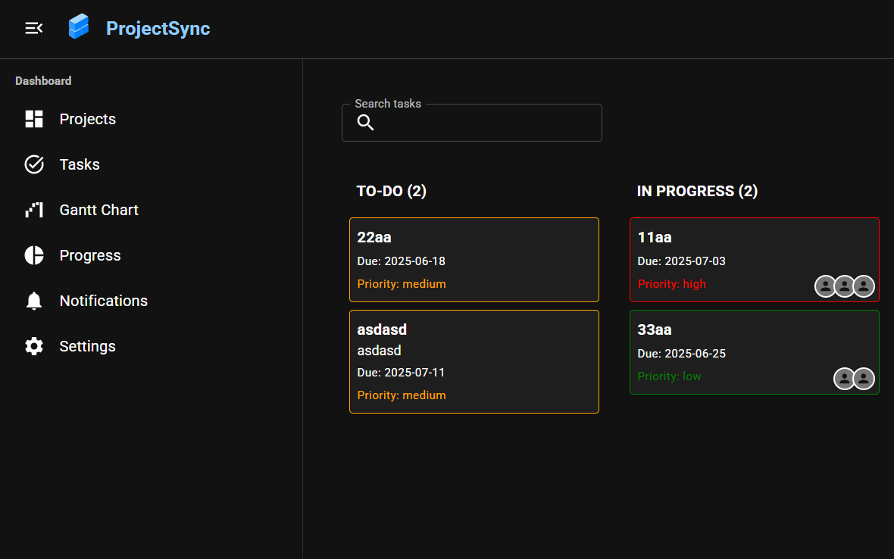
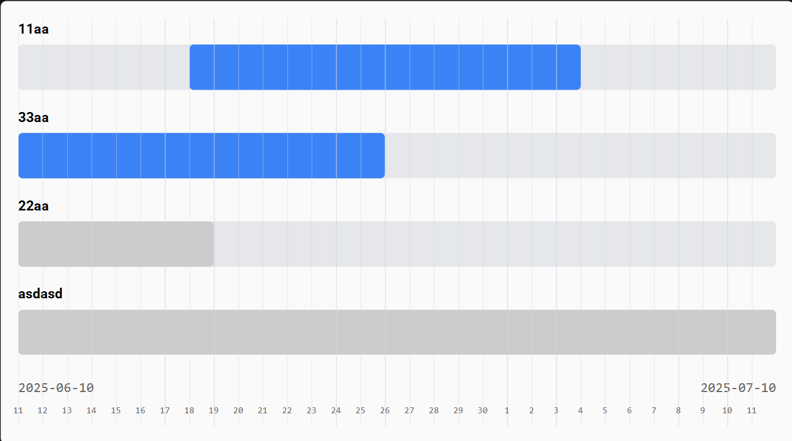
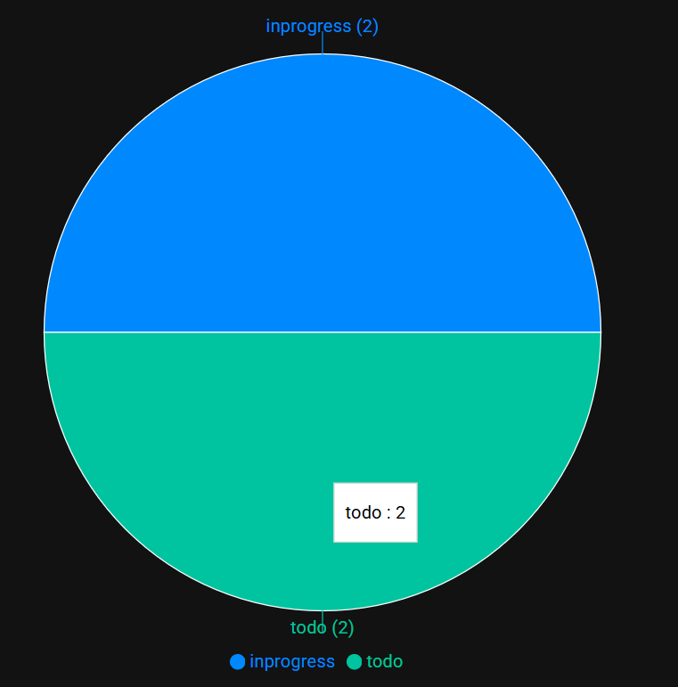
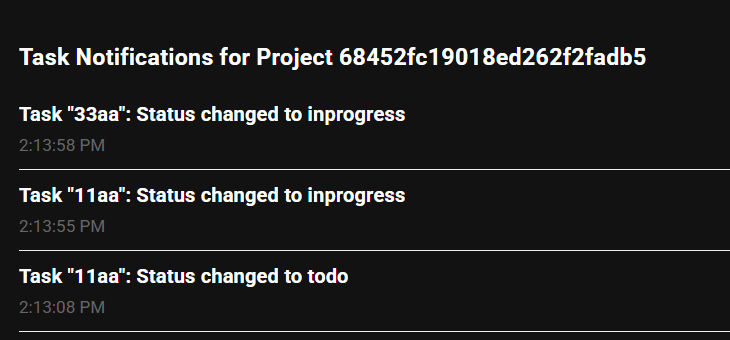
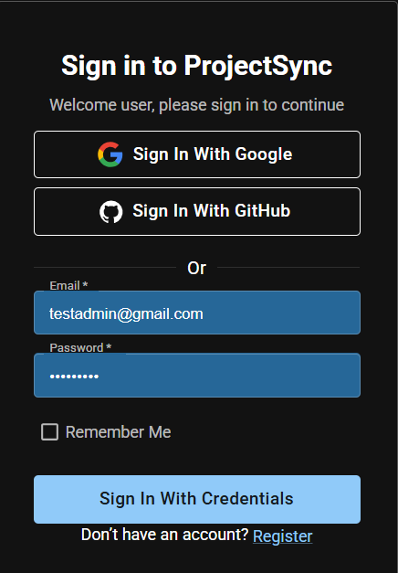

# ProjectSync: Collaborative Project Tracking Webapp

## Core Features

### Kanban Board:

Users can create projects and tasks, organized into columns (e.g., To Do, In Progress, Done).
Drag-and-drop tasks between columns.
Tasks have attributes like title, description, assignee, due date, and priority.

### Task Hierarchy:

Support nested tasks (subtasks) displayed in expandable tables or tree views.
Allow users to collapse/expand task hierarchies for better organization.

### Gantt Chart:

Visualize project timelines with task start/end dates and dependencies.
Highlight critical paths or overdue tasks.

### Progress Tracking:

Generate charts (e.g., pie chart for task completion, burndown chart for sprint progress).
Display project-level and team-level metrics.

### Real-Time Collaboration:

Update task statuses and board changes in real time for all team members.
Notify users of task assignments or comments via in-app notifications.

### User Authentication:

Support user roles (e.g., project manager, team member) with login functionality.

## Technologies

### Frontend:

- React.js: For a dynamic, component-based UI. 
- @hello-pangea/dnd: For drag-and-drop Kanban boards.
- Material-UI: For responsive, polished styling.
- recharts: For pie charts.

### Backend:

- Node.js + Express: For REST API to manage projects, tasks, and users.
- MongoDB: For storing project, user, notification and task data with nested structures.

### Real-Time:

- Socket.IO: For real-time task updates.

### Authentication:

- Firebase Authentication : For secure user login with Google & Github options.
 

